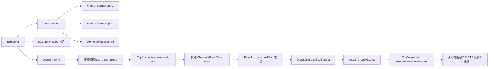
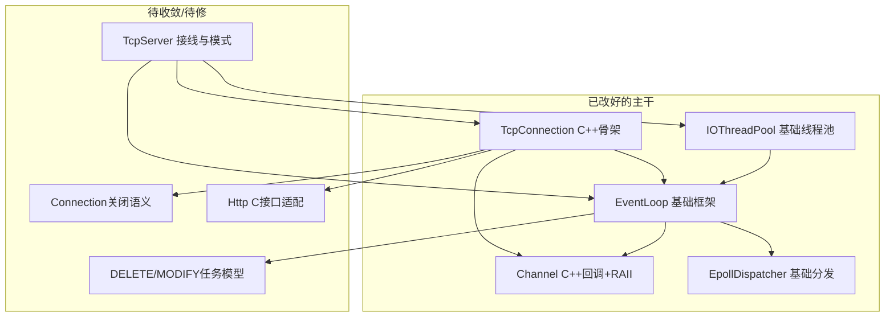

# CPPReactor 项目梳理（当前阶段）

## 1. 组件对应关系（含几对几）

### 1.1 核心 Reactor 关系
- `TcpServer` -> `IOThreadPool`：`1 : 1`
- `IOThreadPool` -> `EventLoop(worker)`：`1 : N`（N = worker 线程数）
- `TcpServer` -> `base EventLoop`：`0 或 1 : 1`（按运行模式决定）
- `EventLoop` -> `Dispatcher`：`1 : 1`（当前实现为 `EpollDispatcher`）
- `EventLoop` -> `Channel`：`1 : N`（通过 `channelMap_` 管理）
- `Channel` -> `fd`：`1 : 1`
- `TcpConnection` -> `Channel`：逻辑上 `1 : 1`（连接对应一个通信 fd 与一个业务 channel）
- `EventLoop` -> `TcpConnection`：`1 : N`（业务上关联，当前通过 server 容器间接持有）

### 1.2 所有权（当前建议口径）
- `TcpServer` 持有 `IOThreadPool`（拥有）
- `IOThreadPool` 持有 worker `EventLoop`（拥有）
- `EventLoop` 持有 `Channel`（拥有）
- `TcpServer`（或 ConnectionManager）持有 `TcpConnection`（拥有）
- `TcpConnection` 仅保存 `EventLoop*`、`Channel*` 观察指针（不拥有）

---

## 2. 当前已改好的关系（可继续沿用）

- `Channel` 已转为 C++ 风格回调（`std::function<void()>`）与 RAII 析构。
- `EventLoop` 已具备任务队列 + wakeup 通知 + `Dispatcher` 分发框架。
- `EpollDispatcher` 已基本形成可用后端（等待 `epoll_wait` 事件后分发到 `EventLoop::active`）。
- `IOThreadPool` 已具备创建 worker loop、停止与 join 的基本结构。
- `TcpConnection` 已开始迁移为 C++ 类，`create/init/handleRead/handleWrite/handleClose` 框架已出现。

---

## 3. 还没改顺的关系（重点风险）

- `TcpServer` 接线层仍有模式分支未收敛：
  - 是否使用 `baseLoop_`、是否先 `threadPool_->start()`、`acceptConnection()` 中 loop 选择路径需统一。
- `TcpConnection::handleClose()` 关闭语义未闭环：
  - 连接关闭应走“删除本连接 channel”而不是“关闭整个 loop”。
- `EventLoop` 任务模型对 `DELETE/MODIFY` 仍依赖传入 `Channel` 对象：
  - 中期建议升级为 `ADD: unique_ptr<Channel>`，`DELETE/MODIFY: fd`。
- HTTP 解析链路暂未完成 C++ 适配（当前按你计划先搁置是合理的）。

---

## 4. 半工业化目标架构（你当前最适合的路线）

---

## 5. 当前代码关系图（已改好与未改好同图）

---

## 6. 一目了然的“几对几”表

| 关系 | 基数 | 备注 |
|---|---:|---|
| `TcpServer` -> `IOThreadPool` | 1:1 | 一个服务一个 IO 线程池 |
| `IOThreadPool` -> `EventLoop(worker)` | 1:N | N 由线程数决定 |
| `EventLoop` -> `Dispatcher` | 1:1 | 当前每个 loop 一个后端 |
| `EventLoop` -> `Channel` | 1:N | loop 管理多个 fd |
| `TcpConnection` -> `Channel` | 1:1 | 每连接一个主要通信 channel |
| `EventLoop` -> `TcpConnection` | 1:N | 业务语义上的多连接 |

---

## 7. 推荐排期（你当前状态可执行）

### P0（今晚到明早，先稳定）
- 统一 `TcpServer::run/acceptConnection` 模式分支：
  - 明确主线程模式和子线程模式的 loop 来源。
- 连接关闭改为“仅删除本连接 channel”，禁止在连接关闭里 `loop->shutdown()`。
- 保证 `threadPool_->start()` 与 `getNextLoop()` 调用时序正确。

### P1（下一步，半工业化闭环）
- `EventLoop` 增加 `modifyTask(fd)` / `deleteTask(fd)`。
- `TcpConnection` 调整为仅投递 fd 任务，避免复制/伪造 `Channel` 对象。
- `TcpServer` 连接容器与连接回收策略稳定（至少不泄漏、不野指针）。

### P2（后续迭代）
- HTTP 解析从 C 接口逐步过渡到 C++ 封装（可先保留桥接层）。
- 补最小回归测试：accept、read、write、close、threadPool stop。

---

## 8. 你现在可以怎么判断“今天可收工”

- 能 accept 新连接；
- 能把连接分配给某个有效 `EventLoop`；
- 关闭一个连接不会让整个 loop 停机；
- 线程池 stop 后线程都能 join，不悬挂。

满足这 4 条，就可以算“可收工版本”；其余工业化内容按 P1/P2 推进。

